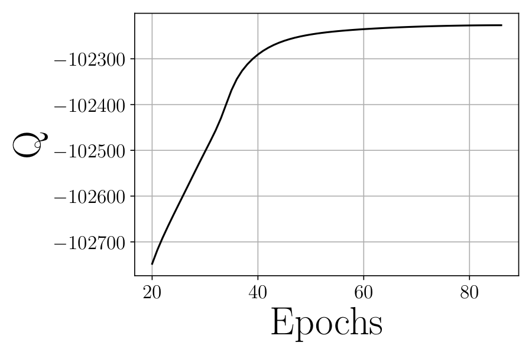
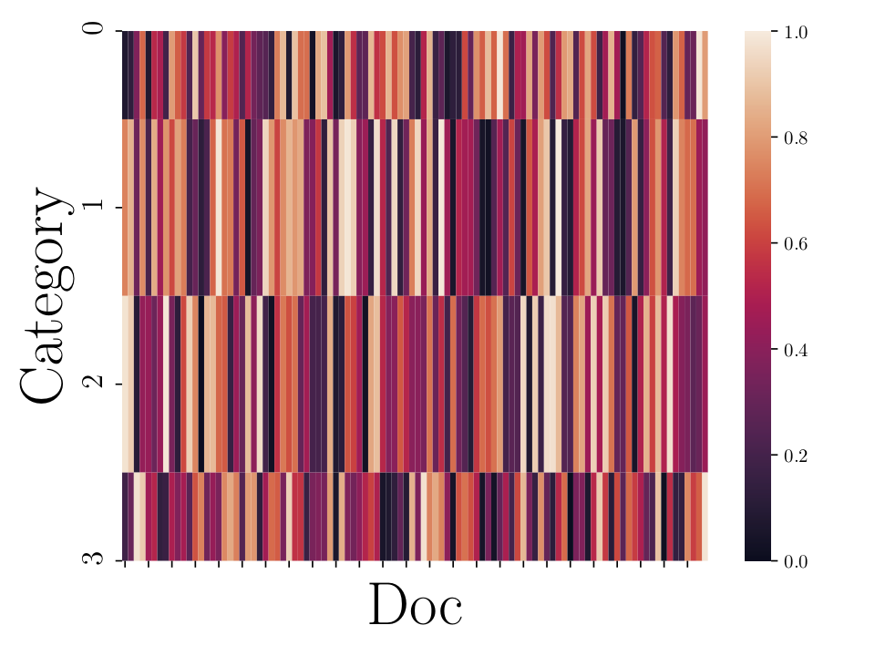

# ProbVis: A collection of functions to visualize your data
A collection of functions to visualize results of different types of data. 
This is an on going project. Check out the `test` folder for examples of usage and 
the `images` folder for results.

## Getting Started
To install, open a terminal window go to the root folder of the project and run:
```
pip3 install ./
```
or 

```
python setup.py install
```

To run the tests:
```
python -m unittest -v tests/test_images.py 
```

## Images

## Distribution package
This is a tentative list of (sooner or later) available distributions: 
* ***Discrete:*** Categorical, Bernoulli, Poisson, ...

* ***Continuous:*** Gaussian, Exponential, Gamma, ... 

* ***Others:*** Mixture of Gaussians, ...
### Categorical
```
import probvis.distributions.categorical as pvc
```

<div style="text-align: center;">
<table width="500" border="0" cellpadding="5">

<tr>

<td align="center" valign="center">

<br />
pvc.word_cloud_plot()
</td>

</table>

</div>

### Exponential

### Gaussian


## General package

### Histogram
```
import probvis.general.heatmap as pvh
```

### General
```
import probvis.general.general as pvg
```

<div style="text-align: center;">
<table width="500" border="0" cellpadding="5">

<tr>

<td align="center" valign="center">

<br />
pvg.simple_plot()
</td>
</tr>

</table>

</div>

### Heatmap
```
import probvis.general.heatmap as pvm
```

<div style="text-align: center;">
<table width="500" border="0" cellpadding="5">

<tr>

<td align="center" valign="center">

<br />
pvg.heatmap_plot()
</td>
</tr>

</table>

</div>

## Author

**Pablo Sanchez** - For any questions, comments or help to get it to run, please don't hesitate to mail me: <pablo.sanchez-martin@tuebingen.mpg.de>

## License

This project is licensed under the MIT License - see the [LICENSE.md](LICENSE.md) file for details